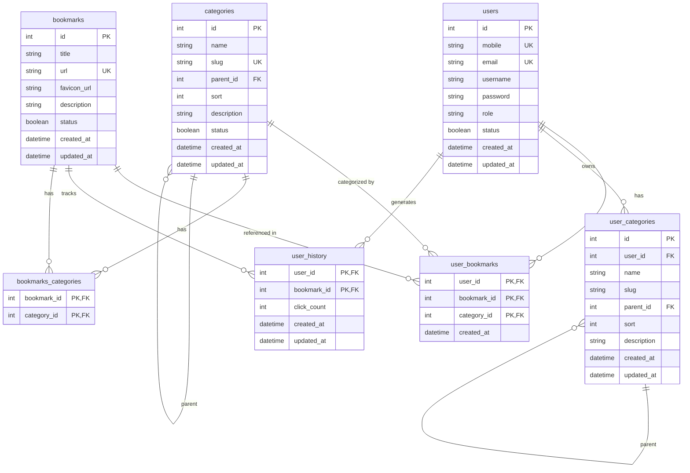

# LinkNest 数据库设计文档

## ER 图



> **设计说明**：
> 1. `bookmarks` 表为全局共享的书签网址库，URL 具有唯一性约束（UNIQUE）。
> 2. `bookmarks_categories` 建立全局共享书签与全局分类的多对多关系。
> 3. `user_bookmarks` 作为用户收藏夹表，建立用户与书签、分类的关联，实现用户的个性化网址收藏。
> 4. `user_categories` 允许用户创建属于自己的私有分类树。
> 5. `user_history` 记录并统计每个用户对具体书签的点击浏览次数。

---

## 表结构详述

### users — 用户表

| 字段 | 类型 | 约束 | 说明 |
|------|------|------|------|
| `id` | INTEGER | PK, AUTOINCREMENT | 用户唯一 ID |
| `mobile` | VARCHAR(20) | UNIQUE, NULLABLE, INDEX | 手机号（可选） |
| `email` | VARCHAR(255) | UNIQUE, NULLABLE, INDEX | 登录邮箱 |
| `username` | VARCHAR(100) | NOT NULL | 显示名称 |
| `password` | VARCHAR(255) | NOT NULL | bcrypt 哈希（$2b$...格式） |
| `role` | VARCHAR(20) | NOT NULL, DEFAULT 'user' | 角色类型，仅限 'admin' 或 'user' |
| `status` | BOOLEAN | NOT NULL, DEFAULT TRUE | 启用状态，1=启用，0=停用 |
| `created_at` | DATETIME | NOT NULL, DEFAULT UTC NOW | 注册时间 |
| `updated_at` | DATETIME | NOT NULL, DEFAULT UTC NOW | 最后更新时间 |

**表级别约束**：
- `ck_users_role` CHECK (`role` IN ('admin', 'user'))
- `ck_users_contact` CHECK (`mobile` IS NOT NULL OR `email` IS NOT NULL) — 手机和邮箱至少保留一项

---

### categories — 全局分类表（自引用树形结构）

| 字段 | 类型 | 约束 | 说明 |
|------|------|------|------|
| `id` | INTEGER | PK, AUTOINCREMENT | 分类唯一 ID |
| `name` | VARCHAR(100) | NOT NULL | 分类显示名称（中文） |
| `slug` | VARCHAR(100) | UNIQUE, NOT NULL, INDEX | URL 友好标识（英文） |
| `parent_id` | INTEGER | FK → categories.id, NULLABLE, INDEX | 父分类 ID，NULL 表示根分类 |
| `sort` | INTEGER | DEFAULT 0 | 同级排序权重，升序 |
| `description` | VARCHAR(500) | NULLABLE | 分类说明文本 |
| `status` | BOOLEAN | NOT NULL, DEFAULT TRUE | 启用状态，1=启用，0=停用 |
| `created_at` | DATETIME | NOT NULL, DEFAULT UTC NOW | 创建时间 |
| `updated_at` | DATETIME | NOT NULL, DEFAULT UTC NOW | 最后修改时间 |

> [!NOTE]
> 数据库字段不包含 `level` 列，分类的层级深度（L1=根, L2=二级, L3=三级）在应用层（Pydantic Schema 或计算属性）中通过遍历树的父子节点动态计算，最大深度为 3。

---

### bookmarks — 全局书签表

| 字段 | 类型 | 约束 | 说明 |
|------|------|------|------|
| `id` | INTEGER | PK, AUTOINCREMENT | 书签唯一 ID |
| `title` | VARCHAR(500) | NOT NULL | 网页标题 |
| `url` | VARCHAR(2048) | UNIQUE, NOT NULL | 唯一完整 URL |
| `favicon_url` | VARCHAR(2048) | NULLABLE | 网站 favicon 地址 |
| `description` | TEXT | NULLABLE | 书签描述/备注 |
| `status` | BOOLEAN | NOT NULL, DEFAULT TRUE | 启用状态，1=启用，0=停用 |
| `created_at` | DATETIME | DEFAULT UTC NOW | 创建时间 |
| `updated_at` | DATETIME | DEFAULT UTC NOW | 最后修改时间 |

---

### bookmarks_categories — 书签-分类关联表（多对多关系表）

| 字段 | 类型 | 约束 | 说明 |
|------|------|------|------|
| `bookmark_id` | INTEGER | PK, FK → bookmarks.id, CASCADE DELETE | 书签 ID |
| `category_id` | INTEGER | PK, FK → categories.id, CASCADE DELETE | 分类 ID |

---

### user_bookmarks — 用户收藏表（个性化书签关联）

| 字段 | 类型 | 约束 | 说明 |
|------|------|------|------|
| `user_id` | INTEGER | PK, FK → users.id, CASCADE DELETE | 用户 ID |
| `bookmark_id` | INTEGER | PK, FK → bookmarks.id, CASCADE DELETE | 书签 ID |
| `category_id` | INTEGER | PK, FK → categories.id, CASCADE DELETE | 关联分类 ID |
| `created_at` | DATETIME | NOT NULL, DEFAULT UTC NOW | 收藏时间 |

---

### user_categories — 用户私有分类表（用户独享分类树）

| 字段 | 类型 | 约束 | 说明 |
|------|------|------|------|
| `id` | INTEGER | PK, AUTOINCREMENT | 分类唯一 ID |
| `user_id` | INTEGER | FK → users.id, CASCADE DELETE, INDEX | 所属用户 ID |
| `name` | VARCHAR(100) | NOT NULL | 分类显示名称 |
| `slug` | VARCHAR(100) | NOT NULL | 标识符（同一用户下不可重复） |
| `parent_id` | INTEGER | FK → user_categories.id, NULLABLE | 父私有分类 ID |
| `sort` | INTEGER | DEFAULT 0 | 排序权重 |
| `description` | VARCHAR(500) | NULLABLE | 说明文本 |
| `created_at` | DATETIME | NOT NULL, DEFAULT UTC NOW | 创建时间 |
| `updated_at` | DATETIME | NOT NULL, DEFAULT UTC NOW | 最后更新时间 |

**唯一约束**：
- `uq_user_category_slug` UNIQUE (`user_id`, `slug`)

---

### user_history — 用户浏览历史表（点击流统计）

| 字段 | 类型 | 约束 | 说明 |
|------|------|------|------|
| `user_id` | INTEGER | PK, FK → users.id, CASCADE DELETE | 用户 ID |
| `bookmark_id` | INTEGER | PK, FK → bookmarks.id, CASCADE DELETE | 访问书签 ID |
| `click_count` | INTEGER | NOT NULL, DEFAULT 1 | 累计点击次数 |
| `created_at` | DATETIME | NOT NULL, DEFAULT UTC NOW | 首次访问时间 |
| `updated_at` | DATETIME | NOT NULL, DEFAULT UTC NOW | 最后访问时间 |

**联合索引**：
- `ix_history_user_count` (`user_id`, `click_count`)

---

## 分类层级逻辑

分类筛选时使用递归查询：选中分类 `category_id=X` 时，查询所有 `parent_id` 路径可达 `X` 的子孙分类 ID 集合，然后从 `bookmarks_categories` 中找出关联了这些分类中任意一个的书签。

```python
def get_all_descendant_ids(db, category_id):
    ids = [category_id]
    children = db.query(Category).filter(Category.parent_id == category_id).all()
    for child in children:
        ids.extend(get_all_descendant_ids(db, child.id))
    return ids
```

---

## 数据统计

| 指标 | 值 |
|------|-----|
| 总表数 | 7 (不含 sqlite_sequence) |
| 根分类 (Level 1) | 17 |
| 二级分类 (Level 2) | 358 |
| 三级分类 (Level 3) | 129 |
| 总分类节点 | 504 |
| 分类最大深度 | 3 |
| 全局书签数 | 2292 |
| 书签-分类映射数 (bookmarks_categories) | 2986 |
